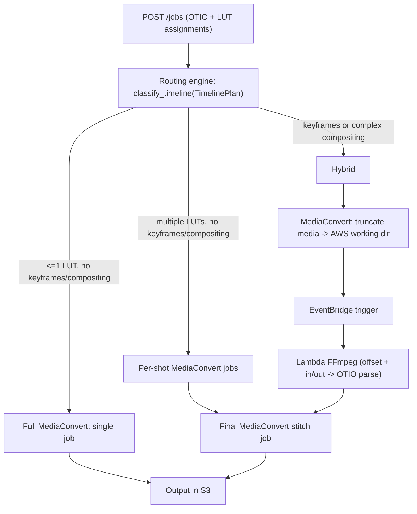

# MediaConvert + Lambda Hybrid Render Architecture

BaseRender is evolving from a single FFmpeg worker into a hybrid cloud render pipeline that uses **AWS MediaConvert** for LUT application, transcoding, truncation, and final stitching, and **AWS Lambda** (with FFmpeg) for timeline features MediaConvert cannot express (keyframes, multi-track compositing, dissolves, static transforms/crops).

The backend decides which execution path to use by classifying the OTIO timeline before any AWS jobs are submitted.

## Routing overview

After a user submits a render job, the API loads the OTIO timeline into a `TimelinePlan` (see [`media-rendering-workflow.md`](media-rendering-workflow.md)) and calls `classify_timeline()` from `packages/baserender/src/baserender/routing.py`.

The classifier returns a `RoutingPlan` with one of three routes:

| Route | When | Execution |
|-------|------|-----------|
| **Full MediaConvert** | Zero or one distinct LUT across the sequence; no keyframes; no complex compositing | One MediaConvert job renders the entire sequence |
| **Per-shot MediaConvert** | Two or more distinct LUTs; still no keyframes or complex compositing | One MediaConvert job per shot, then a final stitch job |
| **Hybrid** | Any shot needs keyframes, compositing, dissolves, or other MediaConvert-incapable features | MediaConvert truncates source media where needed; Lambda runs FFmpeg on proxies; a final MediaConvert job stitches all parts |

## Classification rules

The routing engine is conservative: features MediaConvert cannot reproduce are routed to Lambda.

Per shot, `LAMBDA_FFMPEG` is chosen when any of the following apply (thresholds are module constants in `routing.py`):

- Keyframed animation (`ClipSegment.has_animation`)
- Static transform or crop (`ClipTransform` / `ClipCrop` that is not identity)
- Non-identity opacity animation
- Participation in a dissolve transition
- Multi-track overlay compositing (`TimelinePlan.has_multiple_video_tracks`)

Otherwise the shot is handled by `MEDIACONVERT`.

Overall route selection:

1. If any shot requires Lambda → **Hybrid** (`requires_final_stitch=True`)
2. Else if `distinct_lut_count <= 1` → **Full MediaConvert** (`requires_final_stitch=False`)
3. Else → **Per-shot MediaConvert** (`requires_final_stitch=True`)

Gaps are not shots; they advance the timeline offset but do not produce a `ShotRouting` entry.

## Hybrid path: truncation, Lambda, and stitch

When the route is **Hybrid**:

1. **MediaConvert truncation jobs** extract only the media ranges Lambda needs, writing truncated proxies to an AWS working directory (under the job artifact prefix in S3). This avoids uploading full source files to Lambda.
2. **EventBridge** emits an event when truncation completes (or when all prerequisite MediaConvert jobs finish).
3. **Lambda** receives the truncated media paths plus per-shot timing metadata and runs FFmpeg through the shared `baserender` renderer.
4. **Per-shot MediaConvert jobs** still run for simple LUT-only shots that do not need Lambda.
5. A **final MediaConvert stitch job** concatenates all intermediate outputs (MediaConvert LUT shots and Lambda FFmpeg outputs) into the deliverable.

### Lambda timing contract

For each Lambda-bound shot, `ShotRouting` carries the data Lambda needs to re-time and trim the OTIO parse:

| Field | Meaning |
|-------|---------|
| `timeline_offset_seconds` | Where this shot sits on the output timeline (for timecode adjustment) |
| `source_in_seconds` | Source media in point (`ClipSegment.start_seconds`) |
| `source_out_seconds` | Source media out point (`start_seconds + duration_seconds`) |

Lambda uses these values when parsing the OTIO file so filters and keyframes align with the truncated proxy media.

## AWS resources (target state)

| Resource | Role |
|----------|------|
| **S3 bucket** | Job state, artifacts, working-directory proxies, final outputs |
| **MediaConvert** | Full renders, per-shot LUT jobs, truncation, final stitch |
| **EventBridge** | Orchestration events between MediaConvert completion and Lambda |
| **Lambda** | FFmpeg render for complex shots (replaces the Render.com worker for those paths) |

IAM permissions extend the existing S3 policy (see [`s3-iam-policy.md`](s3-iam-policy.md)) with MediaConvert, EventBridge, and `iam:PassRole` actions for the MediaConvert service role.

### Environment variables (Phase 3)

| Variable | Required | Default | Purpose |
|----------|----------|---------|---------|
| `BASERENDER_MEDIACONVERT_ROLE_ARN` | Yes (for MediaConvert) | — | IAM role MediaConvert assumes when running jobs |
| `BASERENDER_MEDIACONVERT_QUEUE_ARN` | No | — | MediaConvert queue for submitted jobs |
| `BASERENDER_MEDIACONVERT_ENDPOINT` | No | discovered via `describe_endpoints` | Account-specific MediaConvert API endpoint |
| `BASERENDER_EVENT_BUS` | No | `default` | EventBridge bus for orchestration events |
| `BASERENDER_EVENT_SOURCE` | No | `baserender` | EventBridge `Source` field for published events |

S3 working-directory layout is defined in `packages/baserender/src/baserender/storage_layout.py` under `{BASERENDER_ARTIFACT_PREFIX}/jobs/{id}/working/...` (default `baserender/jobs/{id}/working/...`).

## Migrating from the Render.com worker

Today's cloud render path was built for a **long-running Render.com worker** (`apps/worker`), not Lambda. That workflow is poll-based and stateful:

- The worker idle-loops and calls `POST /worker/jobs/claim` on the API.
- The API prepares a worker payload with artifact keys and presigned media URLs.
- The worker downloads the OTIO timeline and LUTs into a local workspace, runs `run_render_job`, sends encode progress via `POST /worker/jobs/{id}/heartbeat`, uploads the output with a presigned PUT, and calls `POST /worker/jobs/{id}/complete` or `/fail`.

Lambda is a different execution model: **event-driven, short-lived, and size/time-bounded**. At some point in this phased rollout we must adapt that Render-oriented workflow—or replace parts of it—so FFmpeg work can run on Lambda. The shared renderer (`packages/baserender`) and `run_render_job` logic should remain reusable; what changes is orchestration around them (how jobs are triggered, how inputs/outputs are staged in S3, how progress and failures are reported, and how the API tracks multi-step jobs).

**Scope (Phase 4):** Lambda reuses `render_otio()` from `packages/baserender` inside a thin handler (`apps/lambda`). Orchestration swaps the worker poll loop for EventBridge-triggered invocations, S3 staging replaces API-proxied artifact downloads, and fine-grained heartbeat progress is dropped for short-lived invocations. Multi-step job state and EventBridge rule wiring remain Phase 5 work.

| Render.com worker today | Lambda equivalent (Phase 4) |
|-------------------------|--------------------------------|
| Poll `POST /worker/jobs/claim` | EventBridge event after MediaConvert truncation (wiring in Phase 5) |
| Download artifacts via worker API routes | Direct S3 get from working directory keys |
| Local temp workspace | Lambda `/tmp` (size limit applies) |
| Heartbeat encode progress to API | Not implemented — short-lived invocation, no fine-grained progress |
| Presigned PUT upload + `complete` | Direct S3 put from Lambda; orchestrator marks step complete (Phase 5) |
| Single job = one worker claim | Hybrid jobs = multiple MediaConvert steps + one Lambda invocation per Lambda-bound shot |

The Render.com worker (`render.yaml` → `baserender-worker`) can remain during transition; the goal is not necessarily to delete it immediately but to stop relying on it for routes that move to MediaConvert or Lambda.

## Phase roadmap

Each phase updates this section and the [Implementation log](#implementation-log) when it lands. A phase is not complete until both the code and this document are updated in the same change.

| Phase | Status | Deliverables |
|-------|--------|--------------|
| **1 — Routing engine** | **Done** | `packages/baserender/src/baserender/routing.py`, `packages/baserender/tests/test_routing.py`, this document |
| **2 — OTIO → MediaConvert JSON** | **Done** | `packages/baserender/src/baserender/mediaconvert.py`, `packages/baserender/tests/test_mediaconvert.py`, `ShotRouting.media_url` in routing |
| **3 — AWS clients** | **Done** | boto3 MediaConvert and EventBridge client wrappers, working-directory storage layout, env config |
| **4 — Lambda FFmpeg handler** | **Done** | `apps/lambda` handler, event contract, OTIO re-time, zip packaging |
| **5 — API integration** | **Done** | Wire `classify_timeline` into `POST /jobs`, branch execution, surface route on job status |

### Phase 1 — Routing engine (Done)

Pure-Python classification with no AWS calls. Public API:

- `RouteKind`, `ShotHandler`, `ShotRouting`, `RoutingPlan`
- `classify_timeline(plan: TimelinePlan, *, settings: RenderSettings | None = None) -> RoutingPlan`

Reusable by the API, future Lambda handler, and the MediaConvert converter in `mediaconvert.py`.

### Phase 2 — OTIO → MediaConvert JSON (Done)

Pure-Python builder with no AWS calls. Callers pass resolved `s3://` URIs for source media, LUTs, and output destinations; the module returns MediaConvert `CreateJob` **Settings** dicts (the `Settings` object inside `CreateJob`, not the full request with `Role`).

Public API in `packages/baserender/src/baserender/mediaconvert.py`:

- `seconds_to_timecode(seconds, fps) -> str` — HH:MM:SS:FF for `InputClippings`
- `build_full_render_job(routing, *, media_uris, output_destination, settings, lut_uri=None, container="mp4")` — stitched inputs for every shot in a `FULL_MEDIACONVERT` route
- `build_per_shot_lut_job(shot, *, media_uri, lut_uri, output_destination, settings, container="mp4")` — single-shot LUT job for `PER_SHOT_MEDIACONVERT` or hybrid LUT-only shots
- `build_truncation_job(shot, *, media_uri, output_destination, settings, container="mp4")` — hybrid proxy extraction via `InputClippings`
- `build_stitch_job(part_uris, *, output_destination, settings, container="mp4")` — concatenate intermediate outputs into the deliverable

**LUT mapping:** creative `.cube` LUTs use job-level `ColorConversion3DLUTSettings` with `REC_709` input/output color space (blank/`0` luminance) and output `VideoPreprocessors.ColorCorrector.ColorSpaceConversion = FORCE_709`. Color spaces are module constants for future override.

**Codec mapping:** mirrors FFmpeg defaults — `h264`/`hevc`/`prores`, `mp4`/`mov`, faststart via `Mp4Settings.MoovPlacement = PROGRESSIVE_DOWNLOAD`.

**Routing prep:** `ShotRouting` now includes `media_url` so builders can resolve injected S3 URIs via a `media_uris` mapping keyed by OTIO media URL.

### Phase 3 — AWS clients (Done)

Thin boto3 wrappers in the API plus a pure S3 working-directory layout in the shared package.

**Working-directory layout** — `packages/baserender/src/baserender/storage_layout.py`:

- `DEFAULT_ARTIFACT_PREFIX`, `job_prefix`, `working_prefix`
- `working_proxy_key`, `shot_output_key`, `stitch_output_key`
- `s3_uri`, `job_uri`, `working_uri`

**MediaConvert client** — `apps/api/src/baserender_api/mediaconvert_client.py`:

- `MediaConvertClient` Protocol + `BotoMediaConvertClient`
- `create_job(settings, *, queue=None, user_metadata=None) -> str` — wraps Phase 2 Settings dicts with `Role` / optional `Queue`
- `get_job(job_id) -> dict` — job status payload
- `get_mediaconvert_client()` — reads `BASERENDER_MEDIACONVERT_*` env vars; discovers endpoint via `describe_endpoints` when `BASERENDER_MEDIACONVERT_ENDPOINT` is unset

**EventBridge client** — `apps/api/src/baserender_api/eventbridge_client.py`:

- `EventBridgeClient` Protocol + `BotoEventBridgeClient`
- `put_event(detail_type, detail, *, source=None, bus=None) -> str`
- `get_eventbridge_client()` — reads `BASERENDER_EVENT_BUS` (default `default`) and `BASERENDER_EVENT_SOURCE` (default `baserender`)

EventBridge rule/target wiring (MediaConvert completion → notifier Lambda; Lambda shot → render Lambda) is documented in Phase 5 and [`s3-iam-policy.md`](s3-iam-policy.md).

**Env config:** `apps/api/.env.example`, `render.yaml`, and [`s3-iam-policy.md`](s3-iam-policy.md) updated with MediaConvert/EventBridge variables and IAM statements.

**Tests:** `packages/baserender/tests/test_storage_layout.py`, `apps/api/tests/test_mediaconvert_client.py`, `apps/api/tests/test_eventbridge_client.py`.

### Phase 4 — Lambda FFmpeg handler (Done)

EventBridge-shaped Lambda handler in `apps/lambda` that processes **one Lambda-bound shot per invocation**. It downloads a truncated proxy and full OTIO timeline from S3, re-times a single-clip OTIO file for the proxy, runs the shared `render_otio()` renderer, and uploads the shot output.

**Package layout** — `apps/lambda/src/baserender_lambda/`:

- `events.py` — `LambdaShotEvent.from_mapping()` parses the per-shot event contract
- `timeline.py` — `prepare_shot_timeline()` locates the source clip by `media_url` + `source_in_seconds`, rewrites `target_url` to the local proxy, sets source range start to `0` (preserves duration and clip effects)
- `handler.py` — `lambda_handler()` / `handle_shot_event()` stages `/tmp` workspace, downloads inputs, renders, uploads output
- `s3_io.py` — `S3Io` Protocol + `BotoS3Io` (injectable for tests)
- `settings.py` — `parse_render_settings()` mirrors worker settings parsing
- `main.py` — local invoke harness (`baserender-lambda event.json`)

**Event contract** (one shot per invocation; Phase 5 orchestrator builds this from `ShotRouting`):

| Field | Source | Purpose |
|-------|--------|---------|
| `job_id` | Job | Artifact prefix segment |
| `bucket` | Job / `BASERENDER_S3_BUCKET` | S3 bucket for get/put |
| `shot_index` | `ShotRouting.index` | Shot identifier |
| `media_url` | `ShotRouting.media_url` | Clip lookup in full OTIO |
| `timeline_offset_seconds` | `ShotRouting.timeline_offset_seconds` | Output timeline position (carried for orchestration; handler preserves for Phase 5) |
| `source_in_seconds` | `ShotRouting.source_in_seconds` | Clip match + truncation in-point |
| `source_out_seconds` | `ShotRouting.source_out_seconds` | Truncation out-point (proxy already clipped) |
| `reasons` | `ShotRouting.reasons` | Diagnostic routing reasons |
| `proxy_key` | `working_proxy_key(job_id, index)` | Truncated media object key |
| `otio_key` | Job input key | Full timeline OTIO |
| `lut_keys` | `{media_url: lut S3 key}` | Per-clip LUT downloads |
| `output_key` | `shot_output_key(job_id, index)` | Upload prefix (handler appends `.mp4`) |
| `settings` | Render settings dict | Width/height/fps/codecs (same shape as worker payload) |

**Handler flow:**

1. Download proxy, OTIO, and LUTs into a `/tmp/baserender-{job_id}-{shot_index}/` workspace.
2. `prepare_shot_timeline()` writes a single-clip OTIO pointing at the local proxy with source start `0`.
3. `render_otio()` produces `{container}` output locally (default `mp4`).
4. Upload to `{output_key}.{container}`; return `{status, job_id, shot_index, output_key, report}`.

**Packaging:** `apps/lambda/build_zip.sh` builds a deployable function zip (`baserender_lambda.handler.lambda_handler`). FFmpeg is supplied via a **Lambda layer** that places `ffmpeg`/`ffprobe` on `PATH` (e.g. `/opt/bin`). Build the zip on Amazon Linux for production deployment.

**Known limitations (Phase 4 scope):**

- **Dissolve and multi-track compositing** shots are not handled by the single-clip re-time model; sequential stitch (`build_stitch_job`) cannot compose overlays or cross-dissolves. These remain TODO for Phase 5 orchestration.
- **No encode progress / cancellation** — unlike the Render.com worker heartbeat loop.
- **EventBridge rule wiring** — handler is unit-testable and locally invokable; production rules and notifier Lambda are Phase 5 (see [`s3-iam-policy.md`](s3-iam-policy.md)).

### Environment variables (Phase 4 — Lambda)

| Variable | Required | Default | Purpose |
|----------|----------|---------|---------|
| `BASERENDER_S3_BUCKET` | Yes (if event omits `bucket`) | — | S3 bucket for proxy/OTIO/LUT get and shot output put |
| `BASERENDER_ARTIFACT_PREFIX` | No | `baserender` | Artifact key prefix (used by orchestrator when building event keys) |
| FFmpeg Lambda layer | Yes (for real renders) | — | Provides `ffmpeg`/`ffprobe` on `PATH`; not bundled in the function zip |

**Tests:** `apps/lambda/tests/test_events.py`, `test_timeline.py`, `test_handler.py`.

### Phase 5 — API integration (Done)

On `POST /jobs`, the API classifies the timeline, submits MediaConvert jobs (or falls back to the Render.com worker), tracks multi-step progress in the single-slot S3 job state, and advances orchestration via EventBridge-driven callbacks.

**Orchestrator** — `apps/api/src/baserender_api/orchestrator.py`:

- `classify_job(otio_text, settings)` — temp-file `load_timeline_plan` + `classify_timeline`
- `build_cloud_artifacts(...)` — resolve `s3://` media/LUT URIs from job assignments
- `start_render(...)` — build Phase 2 MediaConvert Settings, submit jobs with `UserMetadata={job_id, step_id}`, return initial `RenderStep` list
- `advance(job, event)` — mark steps succeeded/failed; emit `BaseRender Lambda Shot` after truncation; submit stitch when all parts complete; finalize job output

**Job model** — `RenderJobStatus` gains `backend` (`cloud` | `worker`), `route`, and `steps: list[RenderStep]`. Each step tracks `kind`, `backend`, `shot_index`, `external_id`, `status`, `output_key`, and `depends_on`.

**API endpoints** — `apps/api/src/baserender_api/app.py`:

- `POST /jobs` — when `BASERENDER_RENDER_BACKEND=cloud` and OTIO is present, classify + start cloud render (`status=running`); otherwise queue for worker claim
- `POST /internal/events` — worker-token auth; accepts normalized completion events; calls `orchestrator.advance`
- `GET /jobs/{id}` — returns `route` and `steps`

Worker gating: `claim()` only returns jobs with `backend == "worker"`. Unsupported timelines fall back to the worker path.

**Completion callback chain:**

1. MediaConvert emits `MediaConvert Job State Change` (terminal states)
2. Render Lambda emits `BaseRender Shot Complete` after upload (`BASERENDER_EVENT_BUS` set)
3. Notifier Lambda (`baserender_lambda.notifier.lambda_handler`) normalizes both event types and POSTs to `/internal/events`
4. API advances steps, emits Lambda work after truncation, submits stitch, marks job succeeded

**Env vars (Phase 5):**

| Variable | Required | Default | Purpose |
|----------|----------|---------|---------|
| `BASERENDER_RENDER_BACKEND` | No | `cloud` | `cloud` for MediaConvert/Lambda orchestration; `worker` for Render.com poll loop |
| `BASERENDER_API_BASE_URL` | Yes (notifier Lambda) | — | API base URL for completion callbacks |
| `BASERENDER_WORKER_TOKEN` | Yes | — | Auth for `/internal/events` and worker routes (shared with notifier Lambda) |

EventBridge rule wiring is manual — see [`s3-iam-policy.md`](s3-iam-policy.md).

**Tests:** `apps/api/tests/test_job_store.py`, `test_orchestrator.py`, `test_cloud_jobs.py`; `apps/lambda/tests/test_notifier.py`, `test_notify.py`.

## Direct transcode (fire-and-forget)

Separate from OTIO timeline renders: the web **Transcode** page (`/transcode`) lists S3 media under a prefix, lets the user select files and encoding settings, and submits one MediaConvert job per file in parallel.

| Aspect | Behavior |
|--------|----------|
| **Endpoint** | `POST /transcode` — accepts `inputs` (S3 keys), `settings`, `container`, optional `prepend_folder` / `append_folder`, optional `dry_run` |
| **Execution** | One MediaConvert `CreateJob` per input; all jobs submitted in parallel; API returns immediately with `{source_key, output_key, mediaconvert_job_id}` per file |
| **Orchestration** | None — no job store, no `RenderStep` tracking, no EventBridge callbacks |
| **Output keys** | `build_transcode_output_key()` in `packages/baserender/src/baserender/transcode.py` preserves source directory structure; prepend/append folders modify the path |
| **Job builder** | `build_transcode_job()` in `mediaconvert.py` — single full-file input, same codec/container mapping as render |

This path is fully independent of `POST /jobs` and can run while a render job is active.

**Tests:** `packages/baserender/tests/test_transcode.py`, `apps/api/tests/test_transcode_api.py`.

## Implementation log

Convention: add a dated entry here whenever a phase is completed. Include the PR or change summary and the files delivered.

| Date | Phase | Summary |
|------|-------|---------|
| 2026-05-29 | 1 | Routing engine: `classify_timeline()` with `RouteKind` (full/per-shot/hybrid), per-shot `ShotRouting` with Lambda timing contract, unit tests. Docs: this file, updates to `media-rendering-workflow.md` and `README.md`. |
| 2026-05-29 | 2 | MediaConvert JSON builder: four job builders (`full`, `per-shot LUT`, `truncation`, `stitch`), `seconds_to_timecode`, REC_709 LUT mapping, codec/container mapping. Added `ShotRouting.media_url`. Tests: `test_mediaconvert.py`. Docs: this file, `media-rendering-workflow.md`, `README.md`. |
| 2026-05-29 | 3 | AWS clients: `storage_layout.py` working-dir key/URI helpers; `mediaconvert_client.py` and `eventbridge_client.py` boto3 wrappers with env factories; env/IAM docs. Tests: `test_storage_layout.py`, `test_mediaconvert_client.py`, `test_eventbridge_client.py`. |
| 2026-05-31 | 4 | Lambda FFmpeg handler: `apps/lambda` package with `LambdaShotEvent`, `prepare_shot_timeline`, `lambda_handler`, S3 I/O, local invoke harness, `build_zip.sh`. Reuses `render_otio`. Tests: `test_events.py`, `test_timeline.py`, `test_handler.py`. Docs: this file. |
| 2026-05-31 | 5 | API integration: `orchestrator.py` (classify, start_render, advance), multi-step `RenderStep` model, cloud/worker branching on `POST /jobs`, `POST /internal/events`, worker claim gating, Lambda `notifier.py` + shot-complete emit. Tests: `test_job_store.py`, `test_orchestrator.py`, `test_cloud_jobs.py`, `test_notifier.py`, `test_notify.py`. Docs: this file, `s3-iam-policy.md`, `.env.example`, `render.yaml`. |
| 2026-05-31 | Transcode | Direct transcode: `POST /transcode` fire-and-forget parallel MediaConvert jobs; `transcode.py` output-key helper; `build_transcode_job()`; web `/transcode` page. No job store or EventBridge. Tests: `test_transcode.py` (package + API). |

## Related documentation

- [`media-rendering-workflow.md`](media-rendering-workflow.md) — OTIO → timeline model → FFmpeg layers and cloud render flow
- [`ffmpeg-filtergraphs.md`](ffmpeg-filtergraphs.md) — FFmpeg filtergraph design (Lambda path)
- [`s3-iam-policy.md`](s3-iam-policy.md) — S3 IAM policy template
