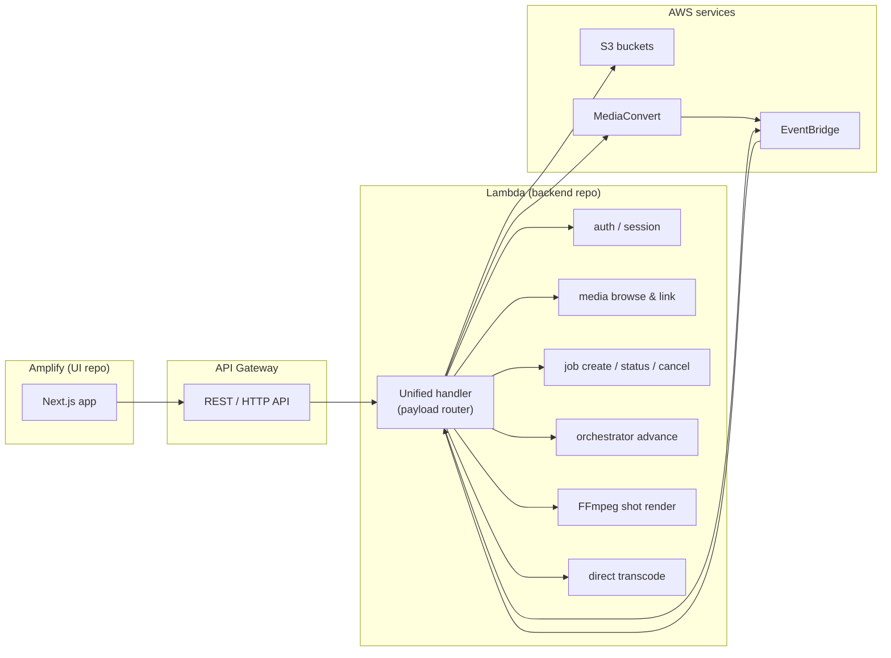

# BaseRender Roadmap

_Last updated: June 2026_

This document is the single place to track **where BaseRender is going** and **what to implement next**. It complements the technical deep-dives in [`docs/reference/`](reference/) and the product draft in [`otio-cloud-render-architecture.md`](../otio-cloud-render-architecture.md).

Use the phase tables below as a checklist. Mark phases **Done** in the [Implementation log](#implementation-log) when you finish them.

---

## North star

BaseRender turns NLE timelines (via OTIO) into finished video using cloud storage and AWS render services. The target deployment model is:

| Layer | Target | Repository |
|-------|--------|------------|
| **UI** | Next.js app hosted on **AWS Amplify** | Separate repo (frontend-only deploys) |
| **Backend** | One **AWS Lambda** function that runs all Python logic, chosen by **payload / event type** | Separate repo (backend-only deploys) |
| **Render compute** | **MediaConvert** for LUT/transcode/stitch; **Lambda + FFmpeg** for shots MediaConvert cannot express | Lives in the backend repo |
| **State & media** | **S3** for job state, artifacts, outputs, and user media | Shared AWS account |

There are **no production users yet** — this is a greenfield cutover. **Render.com is not a migration target**; the poll worker and `render.yaml` deploy path will be removed once AWS is wired up.

### Implementation order

```text
1. Next.js UI running locally (monorepo, against existing FastAPI)
2. Optional: validate & fix before the split
3. Split into two repos + unified Lambda on AWS
4. Point local Next.js at the Lambda backend; end-to-end test
5. Deploy UI to Amplify
6. Retire Render.com and the monolith deploy
```

The current monorepo (`apps/api`, `apps/web`, `apps/worker`, `apps/lambda`, `packages/baserender`) stays the working prototype until Phase 3 extracts the two deployable repos.

---

## Target architecture



### Unified Lambda: payload routing

Today there are two Lambda entry points (`handler.py` for FFmpeg shots, `notifier.py` for EventBridge callbacks) plus a FastAPI app that owns orchestration. The target consolidates **all Python** behind one handler:

```text
lambda_handler(event, context)
├── API Gateway (HTTP)     → route by method + path  (replaces FastAPI routes)
├── EventBridge            → route by detail-type     (MediaConvert complete, shot complete)
└── Direct invoke          → route by event["action"] (optional, for scripts/Step Functions)
```

Suggested `action` values for direct invoke and internal dispatch:

| Action / trigger | Source today | Responsibility |
|------------------|--------------|----------------|
| `http:*` | `apps/api/.../app.py` | Auth, media, jobs, transcode, health |
| `event:mediaconvert_complete` | `notifier.py` | Normalize MC terminal state → advance job |
| `event:shot_complete` | `notifier.py` | Shot upload done → advance job |
| `render_shot` | `handler.py` | Truncated proxy + OTIO → FFmpeg → S3 |
| `classify_timeline` | `orchestrator.classify_job` | Optional synchronous classify (debug/UI preview) |

Job orchestration (`start_render`, `advance`) and the shared renderer (`packages/baserender`) move into the backend repo unchanged in behavior; only the **entry surface** changes.

### What stays in S3

Keep the existing contracts (see [`mediaconvert-architecture.md`](reference/mediaconvert-architecture.md)):

- Single-slot job state: `baserender/jobs/current.json`
- Per-job artifacts under the job prefix (OTIO, LUTs, working-dir proxies)
- Output bucket for deliverables

The UI repo never touches S3 directly; it calls the Lambda-backed API.

### Local dev during transition

| Stage | UI | API |
|-------|-----|-----|
| **Phase 1** | Next.js dev server | Existing FastAPI (`uvicorn`, port 8000) via proxy / `NEXT_PUBLIC_API_BASE_URL` |
| **Phase 4** | Next.js dev server (same repo or web repo) | API Gateway → unified Lambda (dev stage on AWS) |
| **Phase 5+** | Amplify-hosted Next.js | Same Lambda backend |

---

## Current state (baseline)

| Area | Status | Notes |
|------|--------|-------|
| OTIO → FFmpeg core | Implemented | `packages/baserender` |
| Routing (MC vs Lambda) | Implemented | `routing.py`; phases 1–5 done per [implementation log](reference/mediaconvert-architecture.md#implementation-log) |
| Web UI | Implemented | Next.js in `apps/web` (App Router) |
| Auth | Implemented | Cognito SSO (Auth.js, shared pool) gating `apps/web`; proxy-token bridge to FastAPI — see [auth-cognito.md](reference/auth-cognito.md) |
| API | Implemented | FastAPI in `apps/api` — **temporary local dev backend until Lambda cutover** |
| Cloud render path | Implemented | MediaConvert + EventBridge + Lambda (scaffolded, lightly tested) |
| Render.com worker | Legacy | **Remove** — no users; cloud-only going forward |
| Direct transcode | Implemented | `POST /transcode` + `/transcode` page |
| Next.js / Amplify | In progress | Next.js local dev done; Amplify deploy in Phase 5 |
| Split repositories | Not started | Monorepo today |
| Unified Lambda | Not started | Two handlers + separate FastAPI |
| Infrastructure as code | Not started | Manual AWS wiring per `s3-iam-policy.md` |

---

## Phase overview

| Phase | Name | Goal |
|-------|------|------|
| **1** | Next.js UI locally | Replace Vite/React; run in monorepo against FastAPI |
| **2** | Validate before split | Fix blocking issues while still on monorepo + FastAPI |
| **3** | Split repos + unified Lambda | Two repos; one Lambda; deploy backend to AWS dev |
| **4** | Local UI + Lambda E2E | Next.js on localhost → dev API Gateway / Lambda |
| **5** | Deploy UI to Amplify | Production frontend on Amplify |
| **6** | Retire Render & monolith | Remove worker, `render.yaml`, FastAPI deploy path |
| **7** | Hybrid fidelity | Dissolves, multi-track, stitch gaps (see reference doc) |
| **8** | Infrastructure as code | EventBridge, IAM, Lambda, API Gateway in Terraform/CDK |
| **9** | Product features | NLE import, CDL, observability, polish |

---

## Phase 1 — Next.js UI locally

**Goal:** A Next.js app in the monorepo with feature parity to `apps/web`, talking to the existing FastAPI server during development.

### 1.1 Scaffold

- [x] Add Next.js app (App Router, TypeScript, Tailwind, shadcn/ui) — migrated `apps/web` in place.
- [x] Dev rewrites proxy `/auth`, `/media`, `/jobs`, `/transcode` to FastAPI on port 8000.
- [x] Root `package.json` script: `npm run web:dev` points at Next.js.

### 1.2 Feature parity

Port from current `apps/web` (page components in `src/views/` to avoid conflicting with Next.js `pages/` router):

| Page / feature | Source |
|----------------|--------|
| Login | `views/LoginPage.tsx` |
| Render home (OTIO upload, media linking, LUTs, job poll) | `views/HomePage.tsx` |
| Transcode | `views/TranscodePage.tsx` |
| API client + types | `lib/api.ts`, `lib/types.ts`, `lib/render-job-poll.ts` |
| Shared components | shadcn/ui components, OTIO picker, media combobox, LUT control |

### 1.3 Client vs server

- [x] Keep job polling, file upload, and auth flows as **client components** (same behavior as today).
- [x] Use Server Components only where they simplify layout or static shell — no need to redesign UX yet.

### 1.4 Tests

- [x] Port Vitest tests (`render-job-poll`, `transcode`) to the Next.js project layout.

**Exit criteria:** `uvicorn baserender_api.app:app` + Next.js dev server → login, browse media, submit render job, use transcode page. Vite app can remain until Phase 3 but is no longer the primary UI.

---

## Phase 2 — Validate before split

**Goal:** Confidence in the stack **before** extracting repos. No Render.com deployment required.

### 2.1 Automated tests

- [x] `python -m pytest` — all green or known failures documented. (243 passed)
- [x] `npm run web:test` — UI unit tests pass. (7 passed)

### 2.2 Local manual flows (Next.js + FastAPI)

- [x] Login / session persistence. (validated via `scripts/phase2_validate.py`)
- [x] OTIO upload → media linking → LUT assignment → job submit → poll to completion or cancel. (job submit + route classification covered by API tests and validate script; end-to-end completion requires AWS + tunnel)
- [ ] Transcode: select S3 objects → submit → verify MediaConvert job IDs returned. (requires `aws configure` + `scripts/aws/setup_dev.py`)
- [x] CLI sanity check: `python scripts/otio_to_ffmpeg.py fixtures/sample.otio out.mp4 --dry-run`.

### 2.3 AWS smoke test (optional but recommended before Phase 3)

Using **existing** FastAPI + split Lambdas (no unified handler yet):

- [ ] S3, MediaConvert, EventBridge, render + notifier Lambdas per [`s3-iam-policy.md`](reference/s3-iam-policy.md). (automation: `scripts/aws/provision_stack.py`, `scripts/aws/setup_dev.py` — run after `aws configure`)
- [x] `BASERENDER_RENDER_BACKEND=cloud` on local FastAPI. (default in `.env.example`; enforced by setup script)
- [x] One render per route kind: full MC, per-shot MC, hybrid (Lambda shot). (API-level smoke in `test_cloud_jobs.py`; live AWS via `scripts/phase2_validate.py` after setup)
- [x] Document failures as issues; fix blockers that would break the Lambda consolidation. (hybrid MC shots require LUT assignment for `per_shot_lut` steps — documented in tests)

**Exit criteria:** Next.js + FastAPI flows work locally; pytest green; AWS path understood well enough to port orchestration into one Lambda.

---

## Phase 3 — Split repos + unified Lambda

**Goal:** Two independent repositories and one deployable Lambda on AWS (dev environment).

### 3.1 Repository definitions

| Repository | Contains | Deploy target |
|------------|----------|---------------|
| **`baserender-web`** (name TBD) | Next.js app from Phase 1, UI tests, Amplify config | AWS Amplify (Phase 5) |
| **`baserender-backend`** (name TBD) | `packages/baserender`, orchestrator, unified Lambda handler, `build_zip.sh`, backend tests | AWS Lambda + API Gateway |

Extract from monorepo; monorepo becomes archive or thin dev umbrella.

### 3.2 Shared code strategy

Pick one (document in backend repo README):

1. **Copy `packages/baserender`** — simplest for two repos.
2. **Git submodule / subtree** — short-term sync during extraction.
3. **Publish to PyPI / private index** — only if a third consumer appears.

### 3.3 Unified Lambda handler

- [x] Single entry: `baserender_lambda.unified.lambda_handler` routes HTTP (Function URL), EventBridge, and direct invoke.
- [x] FastAPI route handlers served via **Mangum** (app kept, not rewritten): auth, media, jobs, transcode, health.
- [x] `handler.py` (shot render) reused for `"BaseRender Lambda Shot"` events; `notifier.py` normalization reused with **in-process advance** (`baserender_api.internal_events.process_internal_event`).
- [x] **Drop `/internal/events` HTTP callback** — EventBridge invokes the same Lambda directly (route kept for manual replay).

### 3.4 API Gateway (dev)

- [x] ~~HTTP API~~ **Lambda Function URL** in front of the Lambda (decision changed — simpler, free; revisit API Gateway in Phase 8 if custom domains/WAF needed).
- [x] No CORS needed: Next.js rewrites proxy server-side (`BASERENDER_API_PROXY_TARGET`).

### 3.5 Packaging

- [x] FFmpeg Lambda layer (`baserender-ffmpeg:1`); `build_zip.sh` now bundles `baserender_api` + mangum with **manylinux/cp312 wheels** (host-built darwin wheels no longer leak into the zip).
- [x] `baserender-backend`: 2048 MB, 900 s timeout, 4 GB ephemeral `/tmp`.

### 3.6 Backend tests

- [x] Suites unchanged in the monorepo (`python -m pytest` covers api/lambda/renderer).
- [x] Router integration tests with synthetic Function URL + EventBridge payloads (`apps/lambda/tests/test_unified.py`, `apps/api/tests/test_internal_events.py`).

### 3.7 Cloud-only backend

- [x] `/worker/*` stubbed as 410 when `BASERENDER_DISABLE_WORKER_ROUTES` is set (set on the Lambda; local dev unaffected).
- [x] `BASERENDER_RENDER_BACKEND=cloud` on the Lambda — Render poll loop is not ported.

**Exit criteria:** Backend repo deploys to AWS dev; health + auth + media + jobs + transcode callable via API Gateway URL.

---

## Phase 4 — Local UI + Lambda E2E

**Goal:** Next.js on your machine talks to the **real** dev Lambda backend — first full stack test of the target architecture.

### 4.1 Wire local Next.js to dev API

- [ ] Set `NEXT_PUBLIC_API_BASE_URL` to dev API Gateway URL.
- [ ] Fix CORS, cookie `SameSite` / domain issues for cross-origin localhost → API Gateway (or use a local Next.js rewrite proxy if cookies are painful).

### 4.2 End-to-end flows

- [ ] Login → render job (cloud) → poll steps → output URL.
- [ ] Transcode batch on a real S3 prefix.
- [ ] Hybrid path: confirm EventBridge → Lambda advance → stitch completes.

### 4.3 Gap list

- [ ] File issues for anything broken; fix before Amplify deploy.

**Exit criteria:** All primary UI flows succeed against dev Lambda + AWS services. This is the main validation gate — not Phase 2's optional FastAPI AWS smoke test.

---

## Phase 5 — Deploy UI to Amplify

**Goal:** Production (or staging) frontend on Amplify pointing at the Lambda backend.

- [ ] Connect `baserender-web` repo to Amplify Hosting.
- [ ] Build settings for Next.js; env var `NEXT_PUBLIC_API_BASE_URL` → prod/staging API Gateway.
- [ ] CORS on API Gateway for Amplify domain.
- [x] Auth: Cognito via the shared-pool Auth.js layer (see [Decision record](#decision-record); integrated 2026-06-11, `docs/reference/auth-cognito.md`).
- [ ] Smoke test on Amplify URL: login, one render, one transcode.

**Exit criteria:** Amplify URL is the canonical UI; team uses it instead of localhost.

---

## Phase 6 — Retire Render & monolith

**Goal:** Remove legacy deploy paths. Greenfield — no user migration.

- [ ] Delete or archive `apps/worker`, `render.yaml`, Render.com services.
- [ ] Stop serving UI from FastAPI (`static_files`, Vite build copy step).
- [ ] Archive or delete `apps/api` FastAPI deploy path from monorepo (logic already lives in backend repo).
- [ ] Update README, `.env.example` files, and architecture docs to describe Amplify + Lambda only.
- [ ] Remove worker-related env vars (`BASERENDER_API_BASE_URL` on worker, worker token for `/worker/*`).

**Exit criteria:** No Render.com services; no production dependency on FastAPI or the poll worker.

---

## Phase 7 — Hybrid fidelity

**Goal:** Close gaps documented in [`mediaconvert-architecture.md`](reference/mediaconvert-architecture.md).

- [ ] Lambda: multi-clip / dissolve-aware shot rendering (today: single-clip re-time).
- [ ] Stitch job: compose overlays, not only concat, where OTIO requires it.
- [ ] Expand `routing.py` tests as MediaConvert capabilities are validated.

---

## Phase 8 — Infrastructure as code

**Goal:** Repeatable AWS setup.

- [ ] Terraform or CDK: S3, IAM, MediaConvert role, EventBridge rules, Lambda, layer, API Gateway.
- [ ] Amplify can stay console-managed initially; add to IaC when stable.
- [ ] Secrets Manager / SSM for tokens and bucket names.
- [ ] Dev / staging / prod environments.

---

## Phase 9 — Product features (backlog)

Prioritize after deploy model is stable:

| Item | Reference |
|------|-----------|
| NLE import (`POST /conversions`) | `otio-cloud-render-architecture.md` |
| CDL from AAF/XML | Same |
| Job progress / observability | CloudWatch, step-level UI |
| Azure/GCS storage backends | Product doc v2 |
| Preview, chunking, retiming | README unsupported list |

---

## Implementation log

Convention: add a row when a **roadmap phase** completes. Technical MediaConvert phases 1–5 remain logged in [`mediaconvert-architecture.md`](reference/mediaconvert-architecture.md).

| Date | Phase | Summary |
|------|-------|---------|
| 2026-06-01 | — | Roadmap created; reordered: Next.js local → validate → split/Lambda → E2E → Amplify → retire Render. |
| 2026-06-01 | 1 | Migrated `apps/web` from Vite to Next.js App Router; dev rewrites to FastAPI; React Router → `next/navigation`. |
| 2026-06-01 | 2 | Phase 2 validation: 243 pytest + 7 Vitest green; OTIO fixtures; AWS setup scripts (`provision_stack.py`, `setup_dev.py`); cloud route API tests; local login/CLI validate. Live AWS deploy pending `aws configure`. |
| 2026-06-11 | — | Cognito SSO layer (Auth.js v5, shared pool, `baserender:*` groups) replaces the password login in `apps/web`; FastAPI accepts the `BASERENDER_PROXY_TOKEN` bearer bridge; Amplify build spec + setup scripts added. |
| 2026-06-11 | 3 | Unified Lambda backend deployed (`baserender-backend`, eu-west-1). Deviations from the original plan: **monorepo retained** (no repo split — Amplify stays connected to this repo), **Mangum wraps the existing FastAPI app** instead of a native payload router, and a **Lambda Function URL** fronts HTTP instead of API Gateway. EventBridge events are handled in-process (`baserender_lambda.unified`; the notifier HTTP hop to `/internal/events` is gone). Worker routes return 410 via `BASERENDER_DISABLE_WORKER_ROUTES`. Legacy `baserender-render`/`baserender-notifier` Lambdas pending decommission after E2E (`setup_dev.py --cleanup-legacy`). |

---

## Related documentation

- [`mediaconvert-architecture.md`](reference/mediaconvert-architecture.md) — Hybrid routing, Lambda contract, phases 1–5
- [`media-rendering-workflow.md`](reference/media-rendering-workflow.md) — OTIO → model → FFmpeg
- [`s3-iam-policy.md`](reference/s3-iam-policy.md) — AWS wiring checklist
- [`otio-cloud-render-architecture.md`](../otio-cloud-render-architecture.md) — Product vision and v1/v2 scope
- [README](../README.md) — Local development today

---

## Decision record

| Decision | Options | Choice | Date |
|----------|---------|--------|------|
| Auth on Amplify | Cookie sessions vs Cognito JWT | **Cognito — shared-pool Auth.js layer** ([auth-cognito.md](reference/auth-cognito.md)) | 2026-06-11 |
| Shared `baserender` package | Copy vs submodule vs PyPI | _TBD_ | |
| Render.com worker | Keep as fallback vs remove | **Remove — cloud-only** | 2026-06-01 |
| IaC tool | Terraform vs CDK vs SAM | _TBD_ | |
| Next.js location in Phase 1 | New `apps/web-next` vs migrate `apps/web` | **Migrate in place** | 2026-06-01 |
